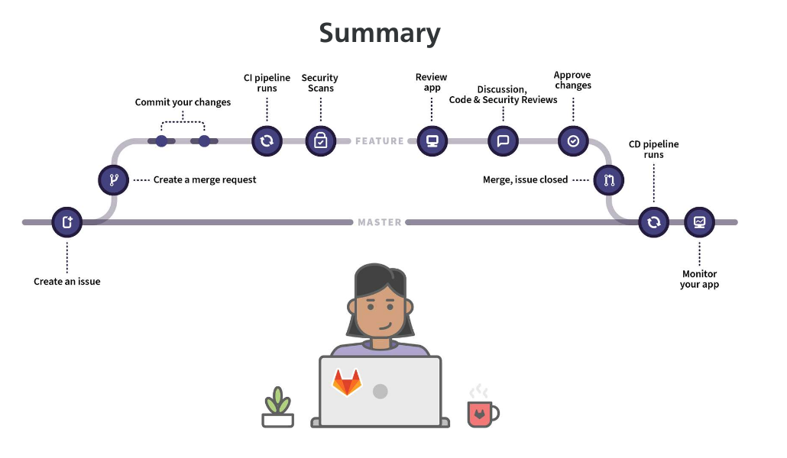

# Git

Repositório para fins de estudo, criado para centralizar o conteúdo necessário para se adquirir uma proficiência com a ferramenta Git. 

O presente conteúdo deste projeto, foca em ser objetivo pra quem lê. As explicações visam atender o básico necessário para compreender os benefícios das quais se propõem.

O repositório é uma iniciativa aberta, sem vinculos profissionais, Pull Requests são bem vindos!

# Introdução 

O Git é um sistema de versionamento, criado para prover um ambiente de gerenciamento projetos eficaz e produtivo, auxiliando principalmente projetos que tenham mais do que um contribuidor. 

- TODO: Explicar o porquê o Git é melhor que o SVN e o Mercurial

## Guia de Comandos

Comandos                                                | Descrição
---                                                     |--- 
git init                                                | Indica que o diretório presente, será versionado com Git. Ao executar, será criado um diretório oculto `.git`, do qual será responsável por manter o estado do versionamento
git config --global user.name "Carlos Neto"             | Indica o nome da pessoa que esta fazendo as alterações no projeto. O parâmetro `--global` diz que a configuração será para todos os arquivos da máquina, caso não tenha, a configuração valeria apenas para o projeto em questão 
git config --global user.email "carlos.neto.dev@gmail"  | Indica o nome da pessoa que esta fazendo as alterações no projeto.
git config --global core.editor $(which code)           | Indica o editor de texto que o git irá abrir quando for necessário escrever alguma mensagem  
git status	                                            | Mostra o estado atual do repositório, exibindo informações como por exemplo: arquivos que estão sendo versionados (com estado `index`/`track`); arquivos não indexados (com estado `working-dir`/`untrack`); arquivos modificados `modified`; e arquivos deletados `delete`.
git add <ARQUIVO>       	                            | Indexa o arquivo indicado ao versionamento git, mudando o seu estágio do mesmo de `working-dir`/`untrack` para `index`
git rm <ARQUIVO>                                        | Remove o arquivo do versionamento, mudando o seu estágio de `index` para `working-dir`/`untrack`
git ls-files	                                        | Lista somente os arquivos que estão em estado `index`/`track`
git commit <ARQUIVO-OU-DIRETORIO> -m <MENSAGEM>         | Muda o estado do arquivo indicado, de `index` para `head`. O parâmetro `-m` é necessário indicar uma mensagem que descreve a mudança que foi feita neste arquivo, se não indicado o parâmeto, será aberto o editor indicado no comando `git config --global core.editor $(which code)`
git whatchanged <ARQUIVO>	                            | "O que mudou?", mosta as mudanças que ocorreram no arquivo indicado, tendo como base, os commits feitos no mesmo
git tag -a <NOME-DA-TAG>                                | Adiciona um rótulo ao presente commit, ou seja, um atalho de alto nível a um determinado o commit. Funcional para indicar um ponto de interesse, como versões estáveis, versões de testes entre outras  
git tag		                                            | Lista todas as tag's do projeto
git diff <TAG-1> <TAG-2>                                | Mostra as linhas de modificados entra as tag's indicadas
git log                                                 | Verifica o histórico de commits, com seu respectivo hash, autor e data   
git log --graph --decorate                              | Verifica o histórico de commits, em visualização de gráficos de linha temporal, levando em considerações o histórico de ramificações do projeto 
git clone <URL-DO-PROJETO>                              | Baixa o projeto existente em um servidor remoto
git branch                                              | Lista as branches locais presentes no projeto
git branch -a                                           | Lista todas as branches presentes no projeto, levando em consideração, branches presente no respositório remoto
git branch -a                                           | Lista todas as branches presentes no projeto, levando em consideração, branches remotas
git remote add origin <URL-REPOSITORIO-REMOTO>          | Associa o versionamento com um repositório remoto centralizado. O parâmetro `origin`, é um apelido de associação para o repositório externo
git push origin main                                    | Envia as modificações (*patch*) locais, ou seja, as que estão em estado `head`, para repositório externo
git checkout -b <NOME-DA-BRANCH>                        | Cria uma nova ramificação a partir da branch atual
git checkout <NOME-DA-BRANCH>                           | Muda o ambiente para a branch especificada. Para mudar o ambiente, é necessário que todos os arquivos estejam no estado 
git merge <NOME-DA-BRANCH>                              | Mescla as mudanças, **na branch atual**, as modificações feitas na branch indicada em `<NOME-DA-BRANCH>`

## Acesso via chaves SSH/RSA

- TDOO: RSA pra que??? 
- TODO: Explicar a diferença entre HTTPS e SSH no acesso ao repositório externo

## Git Flow

O Git Flow, é uma maneira padronizada para se trabalhar com recursos do Git, focado principalmente, para se obter uma produtividade elevada sobre o um projeto com muitos desenvolvedores. 

Quando tiver trabalhando em equipe evite desenvolver no branch main pois poderá dar muitos conflitos. Sempre crie um branch para fazer suas modificações. Por exemplo, você vai desenvolver uma funcionalidade nova para listar os clientes do banco de dados, você poderia criar um novo branch chamado clientes e trabalhar nesse branch para depois jogar ao main

### Terminologias

- **branch-main**: Branch principal do projeto, contendo somente as versões estáveis do projeto. As tags representarão versões do projeto;
- **branch-develop**: Centraliza todo o processo de desenvolvimento atual do projeto;
- **branch-feature**: Ramificações para se criar um ambiente isolado, que serám o escopo para se adicionar uma nova funcionalidade ao projeto. São criadas e mergeadas sempre na `develop`;
- **branch-hotfix**: Branches locais, geradas e posteriormente incorporadas na **main**, criadas a fim de solucionar um *bug* que está presente uma versão em produção;
- **branch-release**: Branches locais, geradas na **develop** e posteriormente incorporadas na **main** e na **develop** subsequentemente. Servem para a criação de uma nova versão de produção, em conjunto com a documentação do que foi feita na mesma;
- **fork**: Pode-se entender como uma adoção/clone de um projeto já existente, para sua conta. É possivel solicitar que as mudanças feitas sejam aderidas no projeto oriundos do fork em questão, em que as mudanças ficam pendentes, mediantes a aprovação do mantenedor do projeto.

### Flow

#### Branch de Features

- Criação de uma **branch-feature**.

```bash
$ git checkout develop
$ git pull origin develop
$ git checkout -b ArrumandoLayout
```

- Incorporando tais modificações na **branch-develop**

```bash
$ git checkout develop
$ git pull origin develop
$ git merge --no-ff ArrumandoLayout
$ git branch -d ArrumandoLayout
$ git push origin develop
```

#### Criação de Branche de versão (Release Branch)

- Criando branch local denominada *release-0.1.0*, apenas para fazer a versionamento. O bump-version é um shell script que irá pegar o nome de cada commit dado na respectiva versão, e criar um arquivo texto com o nome da versão e os commits, isto serve para deixam de uma maneira clara o que foi feita em cada versão.

```bash
$ git checkout develop
$ git pull origin develop
$ git checkout -b release-0.1.0
$ git fetch origin --tags
$ ./bump-version.sh 0.1.0

// Alterar arquivos de versão (pom.xml, etc...)

$ git commit -a -m "Versão alterada para 0.1.0"
```

- Inserindo na main

```bash
$ git checkout main
$ git pull origin main
$ git merge --no-ff release-0.1.0
$ git push origin main
$ git tag -a v0.1.0 -m "Versão 0.1.0"
$ git push origin --tags
```

- Feito o versionamento na main, é hora de incorporar tais commits que representarão a criação de nova versão

```bash
$ git checkout develop
$ git merge --no-ff release-0.1.0
$ git branch -d release-0.1.0
```

#### Hotfix

- Gerando branch de hotfix a partir da main

```bash
$ git checkout main
$ git pull origin main
$ git checkout -b hotfix-0.1.1
$ git fetch origin --tags

// Faz as alterações necessárias

$ ./bump-version.sh 0.1.1

$ git commit -a -m "Versão alterada 0.1.1"
```

- Incorporando hotfix na main

```bash
$ git checkout main
$ git pull origin main
$ git merge --no-ff hotfix-0.1.1
$ git push origin main
$ git tag -a v0.1.1 -m "hotfix-0.1.1 - Correção do bug X"
$ git push origin --tags
```

- Integrando na develop.

```bash
$ git checkout develop
$ git pull origin develop
$ git merge --no-ff hotfix-0.1.1
```

- Caso há branch do tipo **release**. Elas também deverão incorporar as alterações da hotfix.

```bash
$ git branch -d hotfix-0.1.1
```

## Plataformas 

### Gitlab

- TODO: Conteudo do curso de certificação

#### Gitlab-Flow

TODO: Transcrever o conteudo



#### Gitlab-Components

TODO: Transcrever o conteudo


# Referencias

- [@akitaonrails](https://github.com/akitaonrails): *Entendendo GIT | (não é um tutorial!)*: https://www.youtube.com/watch?v=6Czd1Yetaac&ab_channel=FabioAkita
- [@badtuxx](https://github.com/badtuxx): *Descomplicando o GIT: Conheça a ferramenta criada por Linux Torvalds*: https://www.youtube.com/results?search_query=linux+tips+git&ab_channel=LINUXtips
