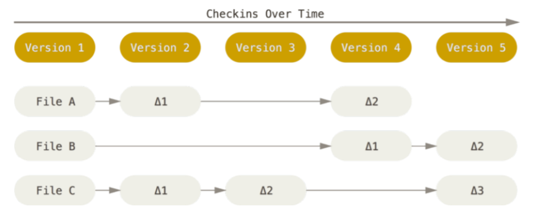
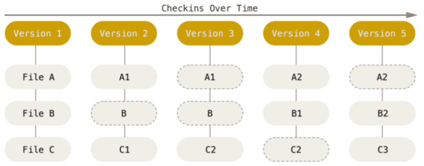

# O Que é? Pra Que Serve?

O Git é um [Sistema de Controle Versões](https://pt.wikipedia.org/wiki/Sistema_de_controle_de_vers%C3%B5es), criado para gerenciar fluxos de desenvolvimento de conteúdo de arquivos digitais, de forma objetiva, produtiva, performática e distribuída. Seu uso é amplo, tanto em projetos *OpenSource* ou Empresarias, principalmente os desenvolvidos de forma colaboradorativa. Atualmente, as linguagens C, Shell e Perl, predominam em seu código fonte, que está acessível no Github [https://github.com/git/git](https://github.com/git/git)

> :warning: Devido aos seus recursos, não é errado associar o Git com as seguintes siglas de definição de tecnologia: 
>
> - VSC - *Version Control System*, 
> - DVSC - *Distributed Source Control Management*; 
> - SCM - *Source Control Management*; 
> - RCS - *Revision Control System*.
> 
> Porém, é importante entender que o Git não se restringe a **exclusivamente** uma sigla, e as associações feitas, tem como base o contexto do qual está presente.

## Um Pouco da História

O Git teve origem no desenvolvimento do Kernel Linux. Durante os anos entre 1991 à 2002, as mudanças introduzidas no código fonte do Kernel, eram emitidas, em sua maior parte via email, por meio de anexos de [tarballs](https://en.wikipedia.org/wiki/Tar_(computing)). O processo, por mais arcaíco e inprodutível que se possa aparecer, na visão de Linus Torvalds, criador e mantenedor do Linux, era melhor do que se utilizar as soluções presentes de VCS do mercado. Os *patches* eram recebidos pelo Linus, e o mesmo controlava o fluxo de colaborações manualmente. Ao passar do tempo, com base no grande volume de colaborações, complexidade e linhas de códigos, tal fluxo de controle se tornou inviável, necessitando então, a presença de um Sistema Distribuído de Versionamento de Arquivos, comumente referenciado por [DVSC - *Distributed Version Control*](https://en.wikipedia.org/wiki/Distributed_version_control).

Em 2002, foi adotado a tecnologia de DVSC proprietária [BitKeeper](http://www.bitkeeper.org/) para o controle do código fonte do Linux. Em 2005, a empresa que desenvolveu o BitKeeper, removeu  o acesso gratuito dos direitos autorais da ferramenta. Tal fato, que combinado com as limitações da ferramenta, levou a comunidade de desenvolvimento do Linux não prosseguir com o uso da ferramenta. Nenhuma solução alternativa no mercado eram satisfatórias, em especial no quesito de performance no ato de mesclar as contribuições no código. Tal fato, levou a comunidade de desenvolvedores do Linux, em especial o própio Linus, a criar uma solução que tinha como meta, os seguintes pontos:

- **Fazer o Oposto do CVS**: Não cometer os mesmos erros que a solução existente [CVS](https://en.wikipedia.org/wiki/Concurrent_Versions_System);
- **Desempenho**: Velocidade para integrar colaborações;
- **Distribuído**: Coloborações não necessariamente centralizadas, assim como a clareza de como se fazer os processos (pontos positivos herdados da experiência com BitKeeper);
- **Integridade**: Mecânismos internos para evitar o corrompimento de arquivos;

Assim, em 2005, sob os termos da licensa [GNU GPLv2](https://www.gnu.org/licenses/old-licenses/gpl-2.0.html), o Git foi lançado. Com o decorrer do tempo, houve inúmeras melhorias, porém as metas inicias foram preservadas.

Atualmente é a principal ferramenta de controle de versão, dominante nos projetos *OpenSource*.

## Caracteristicas

- **Disponibilidade:** 

Por mais que o Git se enquadre no formato [DVSC - *Distributed Source Control Management*](https://en.wikipedia.org/wiki/Distributed_version_control), boa parte de suas operações são locais. Quando um projeto com Git é clonado (baixado), a base de dados que contém os metadados do versionamento do projeto, ficam contidos no diretório `.git` na raiz do repositório. Neste é possível consultar o histórico sem a necessidade de conexão com um servidor centralizado.

- **Segurança:** 

Para preservar a integridade dos arquivos, os mesmos são submetidos a função criptográfica [SHA-1](https://pt.wikipedia.org/wiki/SHA-1), assim, corrompimentos de arquivos serção detectados pelo Git.

- **Gerencia de Estados**: 

A principal diferença entre o Git e as demais soluções existentes de VCS, é forma de como os dados são gerenciados.

> :memo: Como soluções existentes, podemos citar por exemplo o [Subversion](https://subversion.apache.org/), [Perforce](https://www.perforce.com/solutions/version-control)e [Bazaar](https://bazaar.canonical.com/en/)

Algumas das soluções existentes, fazem o controle de versões armazenando dados como alterações em uma versão básica de cada arquivo. Segue o exemplo:

Diferetemente do formato exibido acima, o Git trata seus dados como um **fluxo do estado dos arquivos**. A cada *commit*, ou seja, a cada vez que for salvo o estado do projeto, é criado um *snapshot*. O conteúdo deste *snapshot* é composto pelas referencias dos arquivos presentes no momento. 

O Git é inteligente ao ponto de manter a referência de um arquivo, caso não houver alterações no mesmo entre *commits*.

Este formato, evita redundancia e possibilita benefícios como ramificações e controles de conflitos de forma eficiente e performática.
